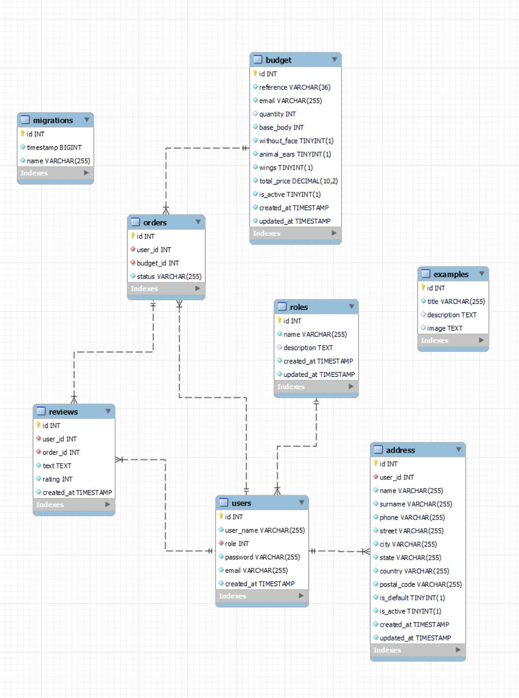

# Ichigo Plushies Backend API 🧸


Welcome to Ichigo Plushies Backend's api documentation. This API recreates the backend of a website where you can request a personalized teddy custom quote, without needing to register. This quote will return a reference code that can be used to complete the order once the user registers.
There is also information about the creator and her social networks and general information about orders.
A user can register, log in, place an order (after completing the quote form), create a shipping address and track the status of their order.

---

## Table of Contents 📂
<ol>
<li><a href="#stack-⚓">Stack ⚓</a></li>
<li><a href="#database-mysql-🌐">DataBase MySQL 🌐</a></li>
<li><a href="#local-installation-💻">Local installation 💻</a></li>
<li><a href="#routes-👾">Routes 👾</a></li>
<li><a href="#Bugs-🐜">Bugs 🐜</a></li>
<li><a href="#Future-features-✨">Future features ✨</a></li>
<li><a href="#author-✒️">Author ✒️</a></li>
<li><a href="#acknowledgements-🙏">Acknowledgements 🙏</a></li>
</ol>

## Stack ⚓


%20%20-%20purple)


## DataBase MySQL 🌐


## Local installation 💻
1. Clone the repository
 ` $ git clone https://github.com/ariusvi/ichiplush_backend `
2. Install dependencies
 ``` $ npm install --y ``` 
3. Start Express on the server
 ``` $ npm run dev ```
4. Run migrations
 ``` $ npm run run-migrations ``` 

5. The <b>HTTP folder</b> includes all routes that can be imported into Thunder Client

## Routes 👾
To test the routes, after the migrations here I leave you some users and their passwords

- **super_admin** 
```json
    {
      "userName": "super_admin",
      "email": "superadmin@email.com",
      "password": "@Test12345"
    }
```

- **Livi** 
```json
    {
      "userName": "Livi",
      "email": "livi@email.com",
      "password": "@Test12345"
    }
```


The routes worked for the project are:

<details>
  <summary><B>AUTHENTICATION (AUTH)</B></summary>

### Register
- **URL:** `/api/auth/register`
- **Method:** `POST`
- **Body Parameters:**
  - `userName`: String, required, must be between 3 and 25 characters. It can include letters, numbers, and underscores.
  - `email`: String, required, must be a valid email address.
  - `password`: String, required, must be between 10 and 30 characters, and include at least one uppercase letter, one number, and one special character
- **Example:**
  - **Request:**
    ```http
    POST /api/auth/register
    ```
    **Body:**
    ```json
    {
      "userName": "username",
      "email": "email@email.com",
      "password": "@Test12345"
    }
    ```


### Login

- **URL:** `/api/auth/login`
- **Method:** `POST`
- **Body Parameters:**
  - `email`: String, required, must be a valid email address.
  - `password`: String, required
- **Example:**
  - **Request:**
    ```http
    POST /api/auth/login
    ```
    **Body:**
    ```json
    {
      "email": "livi@email.com",
      "password": "@Test12345"
    }
    ```
</details>


<details>
  <summary><B>USERS</B></summary>

User routes include:


### Get Users

- **URL:** `/api/users`
- **Method:** `GET`
- **Headers:** `Authorization: Bearer <token>`
- **Middleware:** `auth`, `isSuperAdmin`


### Get User Profile

- **URL:** `/api/users/profile`
- **Method:** `GET`
- **Headers:** `Authorization: Bearer <token>`
- **Middleware:** `auth`


### Update User Profile

- **URL:** `/api/users/profile`
- **Method:** `PUT`
- **Headers:** `Authorization: Bearer <token>`
- **Middleware:** `auth`
- **Body Parameters:**
  - `userName`: String, optional

- **Example:**
  - **Request:**
    ```http
    PUT /api/users/profile
    ```
    **Body:**
    ```json
    {
      "userName": "newUsername",
    }
    ```


### Delete User

- **URL:** `/api/users/delete`
- **Method:** `DELETE`
- **Headers:** `Authorization: Bearer <token>`
- **Middleware:** `auth`, `isSuperAdmin`
- **Body Parameters:**
  - `id`: Number, required
- **Example:**
  - **Request:**
    ```http
    DELETE /api/users/delete
    ```
    **Body:**
    ```json
    {
      "id": 7
    }
    ```
</details>

<details>
  <summary><B>ADDRESS</B></summary>
Address routes include:

### Create Address
- **URL:** `/api/address/create`
- **Method:** `POST`
- **Auth required:** Yes
- **Body Parameters:**
    ```json
    {
  "title": "[string]",
  "name": "[string]",
  "surname": "[string]",
  "phone": "[string]",
  "street": "[string]",
  "city": "[string]",
  "state": "[string]",
  "country": "[string]",
  "postalCode": "[string]",
  "isDefault": "[boolean]"
    }

### Get Address
- **URL:** `/api/address`
- **Method:** `GET`
- **Auth required:** Yes

### Update Address
- **URL:** `/api/address`
- **Method:** `PUT`
- **Auth required:** Yes
- **Body Parameters:**
    ```json
    {
  "title": "[string]",
  "name": "[string]",
  "surname": "[string]",
  "phone": "[string]",
  "street": "[string]",
  "city": "[string]",
  "state": "[string]",
  "country": "[string]",
  "postalCode": "[string]",
  "isDefault": "[boolean]"
    }

### Delete Address
- **URL:** `/api/address`
- **Method:** `DELETE`
- **Auth required:** Yes
- **Body Parameters:**
    ```json
    {
    "id": "[string]"
    }

### Get Default Address
- **URL:** `/api/address/default`
- **Method:** `PUT`
- **Auth required:** Yes
</details>


<details>
  <summary><B>BUDGET</B></summary>
Budget routes include:


### Create Budget
- **URL:** `/api/budget/new`
- **Method:** `POST`
- **Body Parameters:**
    ```json
    {
    "email": "[string]",
    "withoutFace": "[boolean]",
    "animalEars": "[boolean]",
    "wings": "[boolean]",
    "quantity": "[number]"
        }

### Get Budget
- **URL:** `/api/budget/`
- **Method:** `GET`
- **Auth required:** Yes
- **Body Parameters:**

    ```json
    {
    "reference": "[string]"
    }
</details>


<details>
  <summary><B>CATALOGUE</B></summary>

Catalogue routes include:

### Create Item
- **URL:** `/api/catalogue/`
- **Method:** `POST`
- **Auth required:** Yes
- **Middleware:** SuperAdmin
- **Body Parameters:**
```json
{
    "title": "[string]",
    "description": "[string]",
    "image": "[string]"
}
```


### Create Item
- **URL:** `/api/catalogue/`
- **Method:** `PUT`
- **Auth required:** Yes
- **Middleware:** SuperAdmin
- **Body Parameters:**
```json
{
  "itemId": "[string]",
  "title": "[string]",
  "description": "[string]",
  "image": "[string]"
}
```

### Delete Item
- **URL:** `/api/catalogue/`
- **Method:** `DELETE`
- **Auth required:** Yes
- **Middleware:** SuperAdmin
- **Body Parameters:**
```json
{
  "itemId": "[string]",
}
```

### Create Order
- **URL:** `/api/order/create`
- **Method:** `POST`
- **Auth required:** Yes
- **Body Parameters:**
```json
{
  "reference": "1d8b13c0-0f9b-11ef-8ae3-0242ac110002"
}
```
Note: create first a new budget and copy that reference to create Order

### Update Order
- **URL:** `/api/order/update`
- **Method:** `PUT`
- **Auth required:** Yes
- **Middleware:** SuperAdmin
- **Body Parameters:**
```json
{
  "orderId": "[string]",
  "status": "[string]"
}
```

### Get Orders
- **URL:** `/api/order`
- **Method:** `GET`
- **Auth required:** Yes
</details>


<details>
  <summary><B>REVIEW</B></summary>

Review routes include:

### Create Review
- **URL:** `/api/review/create/`
- **Method:** `POST`
- **Auth required:** Yes
- **Body Parameters:**
```json
{
  "orderId": "[string]",
  "text": "[string]",
  "rating": "[number]"
}
```

### Get Review
- **URL:** `/api/review`
- **Method:** `GET`


### Delete Review
- **URL:** `/api/review/`
- **Method:** `DELETE`
- **Auth required:** Yes
- **Middleware:** SuperAdmin
- **Body Parameters:**
```json
{
  "reviewId": "[string]",
}
```
</details>

## Bugs 🐜
- Address update, can't  change isDefault to change default address
- Can't create budgets at data.sql
- Images in cardImage can't be resized to be responsive, so in mobile view the images of cardImage disappear

## Future features ✨
- Improve responsive design<br>
- Change header like a dropdown at mobile view
- Aply react-18next library to translate all website
- Create a newsletter
- Create a interactive image for budget that changes while the form is filled out
- Create an internal chat between artisan and user

## Author ✒️
* Ana Rius - student FSD
    * [GitHub](https://github.com/ariusvi)

## Acknowledgements 🙏
Special thanks to Daniel Tarazona and Demian Ortizlanzas for their incredible work as a teacher and above all for his infinite patience in helping to resolve any doubts and calm the panic.<br>
Thanks to my classmates:<br>
Pedro for his patience and help, especially to confirm that I understand things.<br>
